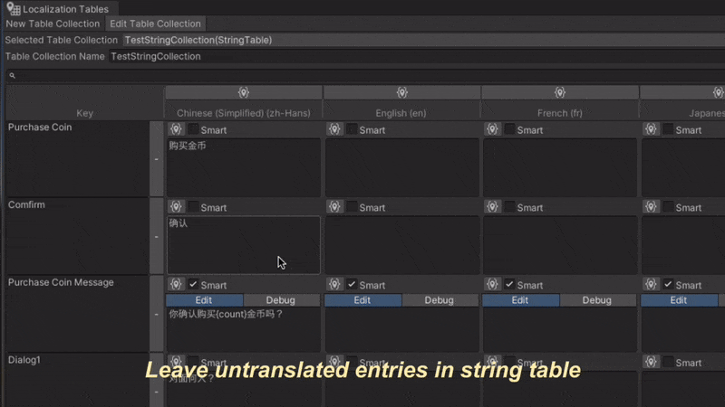

# Unity GPT Localization

English | [简体中文](README_CN.md)

## Introduction

This is a multilingual translation automation tool based on the 
[Unity Localization plugin](https://docs.unity3d.com/Packages/com.unity.localization@1.0/manual/index.html) 
and the [OpenAI API](https://openai.com/blog/openai-api). 
This tool can automatically translate missing string entries in Unity Localization using OpenAI GPT, 
making multilingual support both simple and efficient.



### Features
1. **Integration with Unity Localization**: Automatically find untranslated items in the String Table Collection and sync the results back to the String Table.
2. **Customize translation requirements**: Use the Comment in the String Table Metadata to provide additional translation requirements for GPT, controlling translation result preferences.
3. **Iterate on translation results**: You can delete and retranslate unsatisfactory translation results at any time. You can also specify translation for a single item.

## Usage

### Installing the Plugin

* In the Unity menu, go to `Window > Package Manager`.
* Click `+` and select `Add package from git URL`.
* Enter the following URL:
    ```
    https://github.com/redclock/UnityGPTLocalization.git#release
    ```
* Click `Add` to install.
* If your project does not use the Unity Localization plugin, the Unity Localization plugin will also be automatically installed.

### Configuring the OpenAI API Key
* Go to https://platform.openai.com/api-keys to get your API Key.

## How to Use
Open the `Tools > GPT Localization` menu in Unity to open the GPT Localization window.


### 1. Fill in the GPT Model Parameters
| Parameter    | Description                                                          |
|--------------|----------------------------------------------------------------------|
| Base Url     | Default is https://api.openai.com/v1, can also use other proxy URLs. |
| API Key      | Your OpenAI API Key.                                                 |
| Model        | Choose a GPT model, such as `gpt-3.5-turbo`, `gpt-4-turbo-preview`.  |
| Temperature  | Controls the diversity of translation results, 0.0 for most accurate translation, 1.0 for most diverse translation. |

### 2. Select the String Table Collection
* If no String Table Collection exists, the window will prompt you to create one.
* If there is one, select a String Table Collection from the dropdown menu.
* For testing, you can create some incomplete entries in the String Table.
    - Incomplete means that at least one language has a translation and at least one language does not have a translation for an entry.

### 3. Translate Entries
* The window will automatically list all entries with incomplete translations.
* Click `Translate Selected` to translate all selected entries.
* You can also click the `Translate` button for each entry to translate individually.
* After translation, check the String Table Editor to see that the results have been automatically filled in.
* If you are not satisfied with a result, you can delete it in the String Table Editor and then retranslate.

### 4. Customize Translation Requirements
* Click `Open Table Editor` to open the String Table Editor.
* In the String Table Editor, adding a Comment can control translation result preferences.
* Click Edit Metadata for an entry.

  

* Adding a Comment in the Shared Entry Metadata can control the translation results for all target languages of this entry.
* Adding a Comment in the language-specific Metadata can control the translation result for this entry in a specific language.
* You can control translation results with natural language, such as:
    * The translation result should be more formal.
    * Use short words, no more than 3 words.
    * Japanese should avoid using Katakana as much as possible.
    * The word "Native" should be kept in English in the target language.
    * And so on.
* If you don't know how to write a Comment, you can use this [GPT bot](https://chat.openai.com/g/g-NnmjK7bix-multilingual-prompt-generator) I made to help you write Comments.

## Limitations
* OpenAI API calls require payment.
* Translation results are not guaranteed to be accurate and require manual review.

## References
This project is based on [srcnalt/OpenAI-Unity](https://github.com/srcnalt/OpenAI-Unity): A Unity plugin that supports OpenAI API calls.