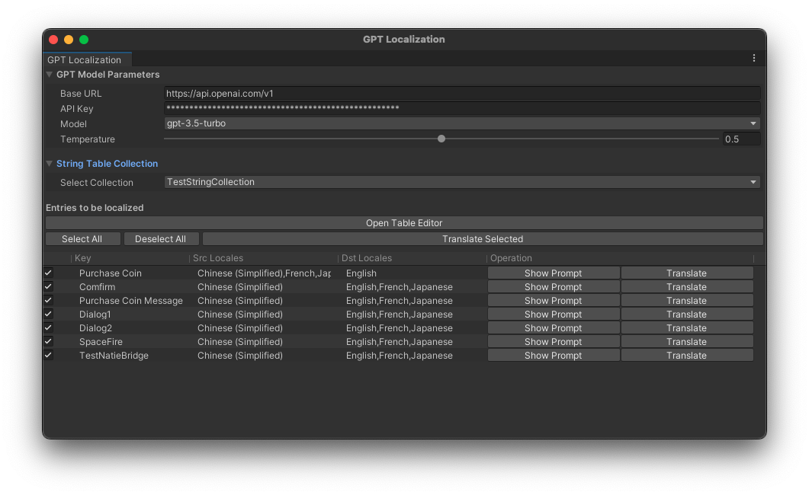
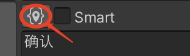

# Unity GPT Localization
[English](README.md) | 简体中文

## 简介

这是一个基于[Unity Localization插件](https://docs.unity3d.com/Packages/com.unity.localization@1.0/manual/index.html)
和 [OpenAI API](https://openai.com/blog/openai-api) 的多语言翻译自动化工具。
此工具可以基于OpenAI GPT自动为翻译 Unity Localization 缺失的字符串条目，让多语言支持变得既简单又高效。


### 特性
1. __关联Unity Localization__：自动查找 String Table Collection 中的未完成翻译项，并将结果自动同步回 String Table。
2. __自定义翻译需求__：通过 String Table Metadata 的 Comment 为 GPT 额外提供翻译需求，控制翻译结果偏好。
3. __迭代翻译结果__：对不满意的翻译结果可以随时删除，重新翻译。也可以单独指定翻译某一项。

### 使用 DeepSeek API
现在这个插件支持 DeepSeek API。
你可以选择 OpenAI 或 DeepSeek 作为翻译服务提供商。 
对于 DeepSeek，将 base URL 设置为 `https://api.deepseek.com` 并选择模型 `deepseek-chat` 或 `deepseek-reasoner`。

## 使用

### 安装插件

* 在 Unity 菜单 `Window > Package Manager` 
* 点击 `+` 选择 `Add package from git URL`
* 输入以下地址
    ```
    https://github.com/redclock/UnityGPTLocalization.git#release
    ```
* 点击 `Add` 安装
* 如果你的项目中没有使用 Unity Localization 插件，Unity Localization 插件也会被自动安装。

### 配置 OpenAI API Key
* 到 https://platform.openai.com/api-keys 获取你的 API Key

### 或者：配置 DeepSeek API Key
* 到 https://platform.deepseek.com/api_keys 获取你的 API Key。

## 使用方法
在 Unity 打开菜单 `Tools > GPT Localization`, 打开 GPT Localization 窗口。



### 1.填入 GPT Model Parameters
| 参数       | 描述                                                  |
|----------|-----------------------------------------------------|
| Base Url | 默认为 https://api.openai.com/v1, 也可以使用其他的代理地址         |
| API Key  | 你的 OpenAI API Key                                   |
| Model    | 选择一个 GPT 模型，如 `gpt-3.5-turbo`，`gpt-4-turbo-preview` |
| Temperature | 控制翻译结果的多样性，0.0 为最准确的翻译，1.0 为最多样的翻译                  |

### 2. 选择 String Table Collection
* 如果没有建立 String Table Collection，窗口会提示你创建一个。
* 如果存在，在下拉菜单中选择一个 String Table Collection.
* 为了测试，可以在String Table中建立一些未完成的 Entry
  - 未完成指至少一项语言已有翻译，且至少一个语言没有翻译的Entry。

### 3. 翻译条目
* 窗口中会自动列出所有未完成翻译的条目。
* 点击 `Translate Selected` 翻译所有选中的条目。
* 也可以点击每个条目的 `Translate` 按钮单独翻译。
* 翻译结束查看 String Table Editor，会看到结果已经自动填入。
* 如果对某个结果不满意，可以在String Table Editor 中删除结果，然后就可以重新翻译。

### 4. 自定义翻译需求
* 点击 `Open Table Editor` 打开 String Table Editor。
* 在 String Table Editor 中添加 Comment，可以控制翻译结果偏好。
* 点击某一个条目的 Edit Metadata

  

* 在Shared Entry Metadata中添加 Comment，可以控制这个条目所有目标语言的翻译结果。
* 在语言指定的Metadata中添加 Comment，可以控制这个条目某个语言的翻译结果。
* 可以通过自然语言控制翻译结果，如：
  * 翻译结果要正式一些
  * 要用简短的词语，最多 3 个词
  * 日语尽量不要用片假名
  * Native这个词要在目标语言中保持为英文
  * 等等
* 如果不知道如何写 Comment，可以用我做的这个 
   [GPT bot](https://chat.openai.com/g/g-NnmjK7bix-multilingual-prompt-generator)
   来帮你写 Comment。

## 限制
* 由于 OpenAI API 调用需要付费。
* 翻译结果不保证准确，需要人工审核。

## 引用
本项目基于 [srcnalt/OpenAI-Unity](https://github.com/srcnalt/OpenAI-Unity): 支持 OpenAI API 调用的 Unity 插件。


